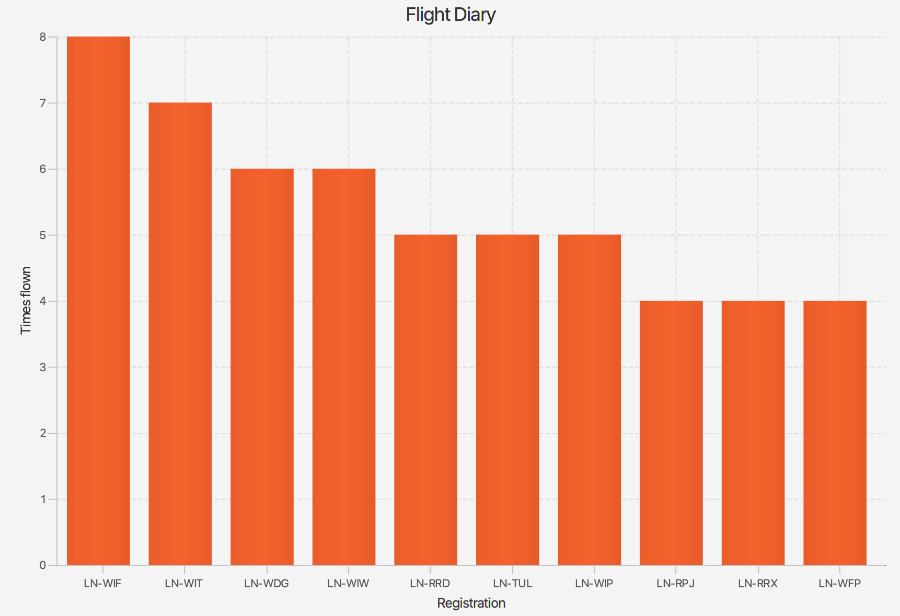

# FlightDiary
Program that takes a CSV file from myFlightradar24 as input, and generates a histogram with a descending list of the 
most flown planes in the file.

## Result
Here is the result showing the 25 most flown plane registrations in the list.
